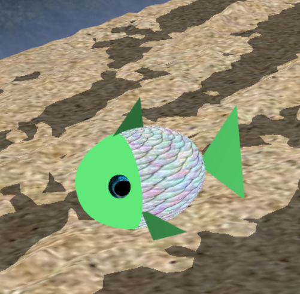

# CGRA 2020/2021

## Group T04G12

## Alberto Cunha - up201906325

## Project Notes

- We didn't find much trouble in making the project
- However the fps are a bit low

## Screenshots

## 1 - MyFish

## 2 - Sea Floor

## 3 - Sea Surface

## 4 - Stones

## 5 - MyPillar

## 6 - Scene

## 7 - Moving Fish

## 8 - Extra Features

### Algae

### Throwing Stone

### MyAnimatedFish

